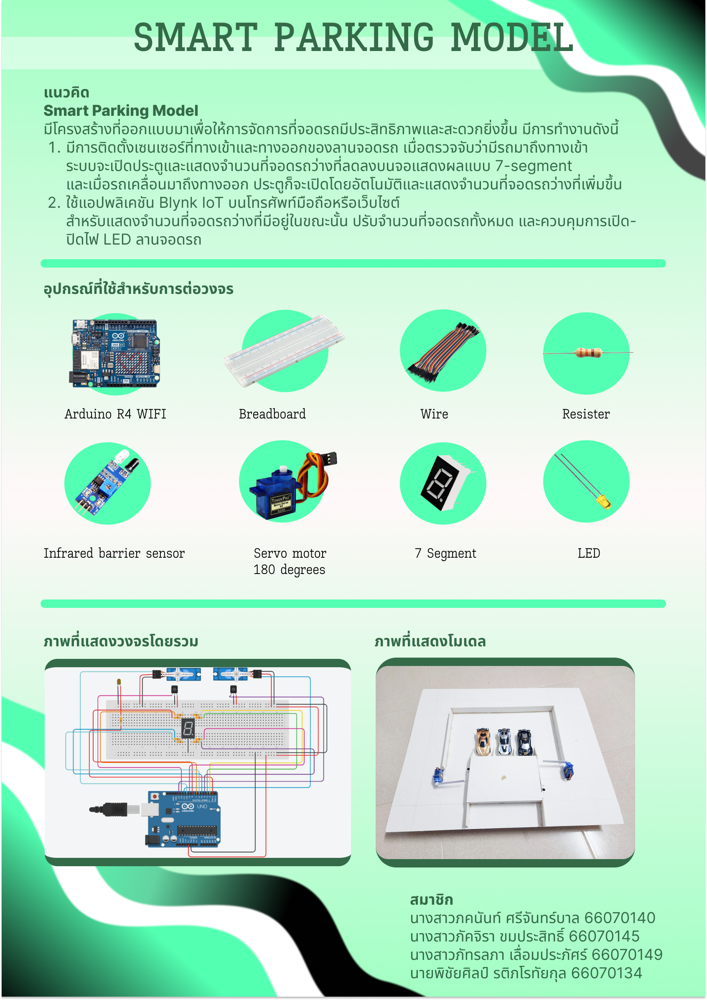

# SmartParking-Model
Physical Computing Project 2024 - IT KMITL

## Overview
SmartParking Model เป็นแบบจำลองที่ออกแบบมาเพื่อตรวจสอบและรายงานสถานะการจอดรถโดยอัตโนมัติ โดยใช้เซ็นเซอร์ตรวจจับรถในแต่ละช่องจอด เมื่อมีรถจอดอยู่ เซ็นเซอร์จะส่งข้อมูลไปยังระบบเพื่ออัปเดตสถานะช่องจอดแบบเรียลไทม์ จากนั้นข้อมูลจะถูกส่งไปยังโทรศัพท์มือถือผ่านระบบ Arduino IoT Cloud ทำให้ผู้ใช้งานสามารถตรวจสอบที่จอดรถว่างได้ทันทีผ่านอุปกรณ์มือถือ ซึ่งช่วยอำนวยความสะดวกและลดเวลาการค้นหาที่จอดรถในสถานที่ที่มีความหนาแน่นสูง

## Blink
Blink : https://blynk.io/
Library Blink : https://docs.blynk.io/en/blynk-library-firmware-api/installation

## Project Demo Video
https://www.youtube.com/watch?v=Rb4mVsnm5Cg

## Wed github
https://66070149.github.io/smartparkingweb/index.html

## Contributor
| Student ID | Name | ส่วนที่รับผิดชอบ | picture |
|--|--|--|--|
| 66070145 | นางสาวภัคจิรา ขมประสิทธิ์ | เขียนโค้ด, ต่อโมเดล |  |
| 66070140 | นางสาวภคนันท์ ศรีจันทร์บาล | ต่อวงจร |  |
| 66070149 | นางสาวภัทรลภา เลื่อมประภัศร์ | coding |  |
| 66070134 | นายพิชัยศิลป์ รติภโรทัยกุล | ต่อวงจร, video |  |

## Poster

